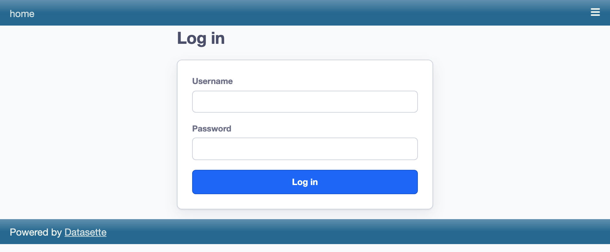
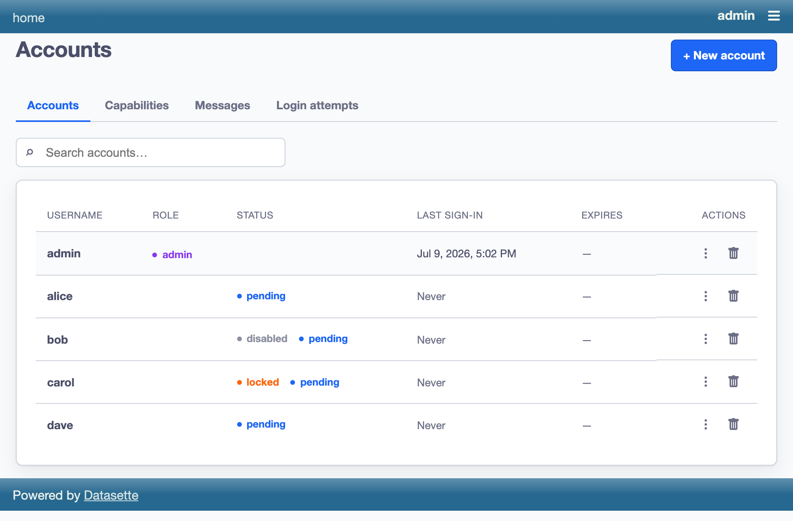
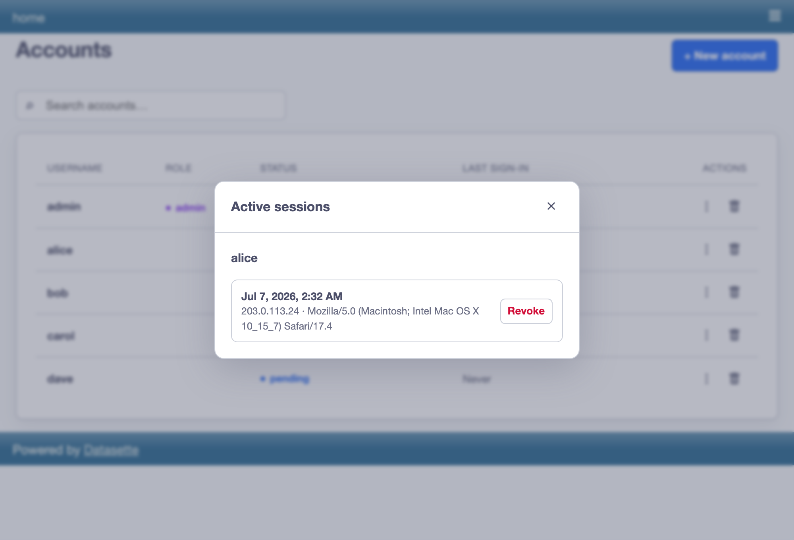
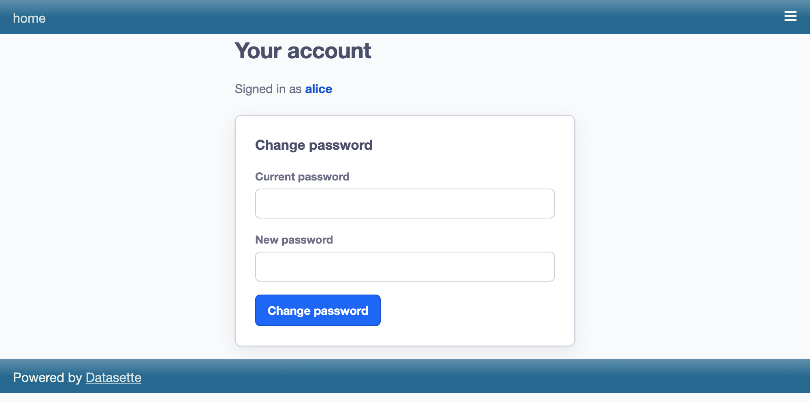

# datasette-accounts

Username/password authentication for [Datasette](https://datasette.io) with
**accounts stored in the internal database** (not in plugin config). Provisioning,
password resets, disabling, and admin management all happen at runtime through an
admin UI and JSON API, guarded by a real Datasette 1.0 permission.

> **"Basic" as in database-backed basic login — not HTTP Basic auth.**

## Features

- **Database-backed accounts** in Datasette's internal DB (create / disable /
  delete / reset-password / toggle-admin / unlock at runtime).
- **Server-side sessions** — revocable per-device, with "log out everywhere" and
  an admin session list. Disabling an account or revoking a session takes effect
  on the next request.
- **A registered admin action** (`datasette-accounts-admin`) that is
  self-answered for `root` and enabled admins, and composes with `datasette-acl`
  / config `allow` blocks.
- **Security hardening** built in: timing-safe login (no username enumeration),
  PBKDF2 run off the event loop, unconditional CSRF gates, strict `?next=`
  validation, brute-force lockout (shared by login and change-password), forced
  first-password-change, audit logging, and retention/pruning.
- **A Svelte/TS frontend** for the login, account, and admin pages.
- **Integrates with `datasette-user-profiles`** (a required dependency) — emits a
  stable actor `id` and seeds the profiles directory, so every account can view
  and edit their profile once granted the `profile_access` permission.

## Installation

```bash
datasette install datasette-accounts
```

Requires Datasette **1.0a23+** and Python 3.10+.

## Getting started

### 1. Persist accounts with `--internal`

Accounts live in the internal database, which is an **ephemeral temp file unless
you pass `--internal`**. The plugin prints a loud startup warning when it is
ephemeral. For any real use:

```bash
datasette mydata.db --internal accounts.db
```

### 2. Bootstrap the first admin with `--root`

There is no admin until you make one. Start Datasette with `--root`:

```bash
datasette mydata.db --internal accounts.db --root
```

Datasette prints a one-time `http://…/-/auth-token?token=…` URL that logs you in
as `root`. `root` is always allowed the admin action, so open **`/-/admin/users`**,
create your first real admin account, then restart without `--root`.

Alternatively, hash a password for scripted setup:

```bash
datasette hash-password
# pbkdf2_sha256$480000$…
```

### 3. Day-to-day

- Users log in at **`/-/login`** and manage their own password at **`/-/account`**.
- Admins manage accounts at **`/-/admin/users`**.
- The Datasette menu gains **Log in** / **Log out** / **Your account** entries,
  and **Accounts** for admins.

## Screenshots

Users log in at `/-/login`:



Admins manage accounts at `/-/admin/users` — create accounts and disable, lock,
reset, promote, or delete existing ones:



Each account's active sessions can be listed and revoked individually:



Users change their own password at `/-/account`:



These are regenerated with `just shots` (a self-contained Playwright pipeline —
see [Development](#development)).

## Configuration

All options live under the `datasette-accounts` plugin block and have safe
defaults (a zero-config install works — it just warns about persistence):

| option | type | default | meaning |
|--------|------|---------|---------|
| `session_ttl_days` | int | `14` | absolute session lifetime |
| `password_min_length` | int | `8` | minimum new-password length (max is fixed at 1024) |
| `lockout_threshold` | int | `5` | consecutive failures before lock; `0` disables lockout |
| `lockout_minutes` | int | `15` | auto-unlock window after a lock |
| `secure_cookie` | `"auto"` / `true` / `false` | `"auto"` | Secure flag on the session cookie |
| `audit_retention_days` | int | `90` | delete `login_audit` rows older than this; `0` = keep forever |
| `trust_proxy_headers` | bool | `false` | trust `X-Forwarded-Proto` / `X-Forwarded-For` (set only behind a trusted proxy) |

```yaml
plugins:
  datasette-accounts:
    session_ttl_days: 30
    password_min_length: 12
    secure_cookie: true        # recommended behind a TLS-terminating proxy
    trust_proxy_headers: true  # only if a trusted proxy sets the forwarded headers
    audit_retention_days: 30
```

### User profiles

Accounts are seeded into [`datasette-user-profiles`](https://github.com/simonw/datasette-user-profiles)
automatically, but its profile pages are gated by the `profile_access`
permission, which denies by default. Grant it to every signed-in account so they
can view and edit their own profile:

```yaml
permissions:
  profile_access:
    id: "*"        # any actor with an id — i.e. any signed-in account
```

or on the command line:

```bash
datasette mydata.db --internal accounts.db -s permissions.profile_access.id '*'
```

### Deploying behind a reverse proxy (nginx / Caddy / Fly / Cloud Run)

When TLS is terminated at a proxy, Datasette sees plain HTTP, so the default
`secure_cookie: "auto"` will only mark the cookie `Secure` if the proxy forwards
`X-Forwarded-Proto: https` **and** you set `trust_proxy_headers: true`. The
simplest robust choice for a proxied production deployment is
`secure_cookie: true`. `trust_proxy_headers` also governs which client IP is
recorded in the audit trail — leave it `false` unless a trusted proxy sets those
headers, or they become attacker-spoofable.

## Security model

- **Identity only.** This plugin owns accounts, passwords, sessions, and one
  `is_admin` flag. Resource-level authorization (who can see which database/table)
  is delegated to `datasette-acl` or config `allow` blocks, which consume the
  actor it emits: `{"id": "<ULID>", "username": "…", "is_admin": bool}`.
- **Passwords** use PBKDF2-HMAC-SHA256 (480,000 iterations), run in a thread so a
  verification never blocks the event loop.
- **CSRF** is enforced unconditionally in the plugin (JSON Content-Type +
  `Origin`/`Sec-Fetch-Site`), not by relying on middleware. All mutation
  endpoints are POST-only.
- **Forced password change** is enforced globally via an `asgi_wrapper`: a user
  with a temporary password can reach only the account/change-password/logout
  pages until they change it.
- **Audit**: `login_audit` records login and change-password attempts;
  `admin_audit` records every admin mutation (who, what, when, target).

See [`plans/start/`](plans/start/) for the full design and decision log.

## Development

```bash
uv sync                       # Python deps
npm install --prefix frontend # frontend deps
just types                    # regenerate page-data types
just frontend                 # build the Svelte frontend
just test                     # pytest
just check                    # ruff + svelte-check
just shots                    # regenerate docs/screenshots/*.png (Playwright)
```

`just shots` boots a throwaway Datasette with seeded demo accounts
(`frontend/scripts/shot-plugins/seed.py`), drives Playwright through the pages
(`frontend/scripts/screenshots.mjs`), and writes the committed PNGs. It is
deterministic — a re-run with no UI change produces no git diff — and is a
manual local task, never run in CI.

Three-terminal dev loop (Datasette 8006 / Vite 5180):

```bash
just frontend-dev     # Vite HMR
just dev-with-hmr     # Datasette, restarts on .py changes
```

## License

Apache-2.0
